# Regelwerk

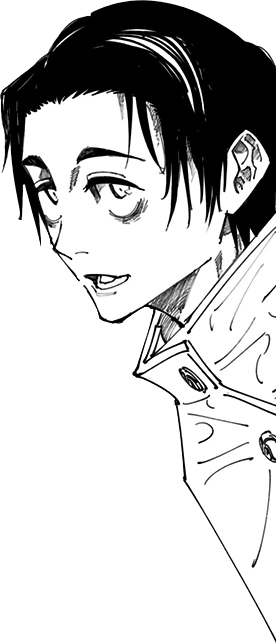

* TOC
{:toc}

## Tags

Die Beschreibung deines Charakters basiert auf Tags. Widersprüchliche Tags können nicht kombiniert werden. Diese Tags beeinflussen größtenteils das Rollenspiel. Wenige Tags beeinflussen Spielmechaniken.

### Voraussetzungen

Während der Charaktererstellung wirst du auf Voraussetzungen stoßen. Zum Beispiel hat die [Fluchtechnik](#fluchtechniken) [Fluchrede](#fluchrede) die Voraussetzung `Inumaki`, diesen Tag bekommst du, wenn du dem [Inumaki Klan](#inumaki) angehörst.

## Erfahrung

Wärend der Kampagne erhält dein Charakter Erfahrung. Für dieses Regelwerk ist vorgesehen, dass die möglichen Erfahrungspunkte von 0 bis 10000 reichen.

## Charaktererstellung

1. Wähle einen **[Klan](#klans)**.
   Dieser bestimmt auch einen Großteil deiner Vergangenheit, wenn du dich für eine der drei großen Klans (Gojo, Kamo und Zenin) entscheidest.
1. Passe deinen **Hintergrund** an.
   Gebunden an das, was dein Klan dir vorgibt, kannst du deinen Hintergrund frei wählen.
1. Passe deine **[Uniform](#uniform)** an

## Uniform

Wenn du möchtest, kannst du Details deiner Uniform ändern lassen.

### Standard


### Anpassungen

<div style="display: flex; width: 100%; align-items: flex-end; flex-wrap: wrap">
  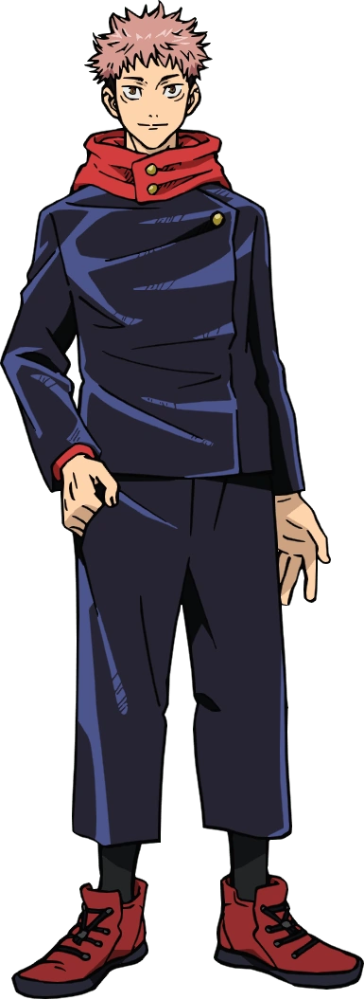
  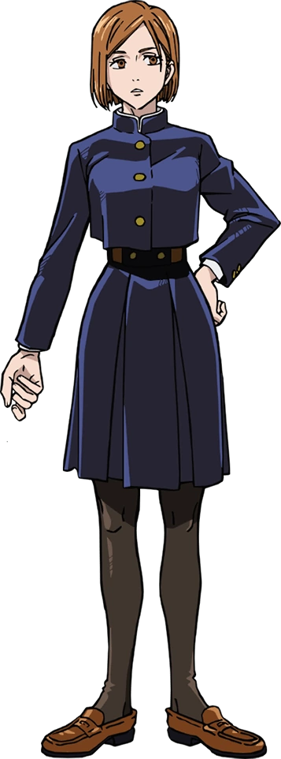
  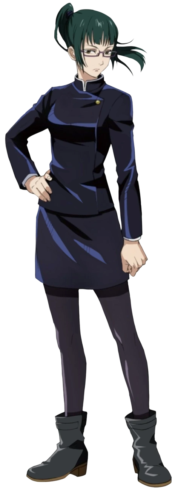
  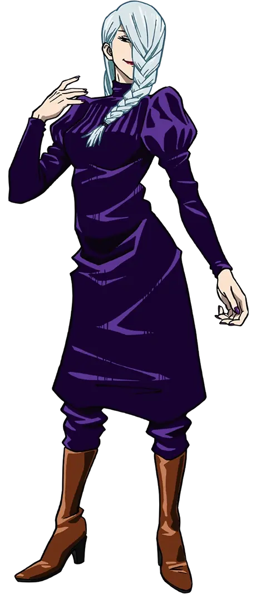
  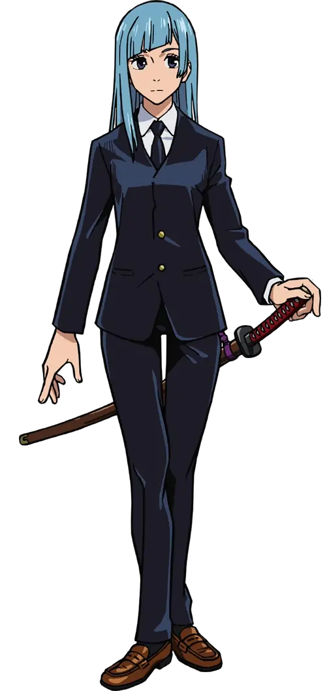
  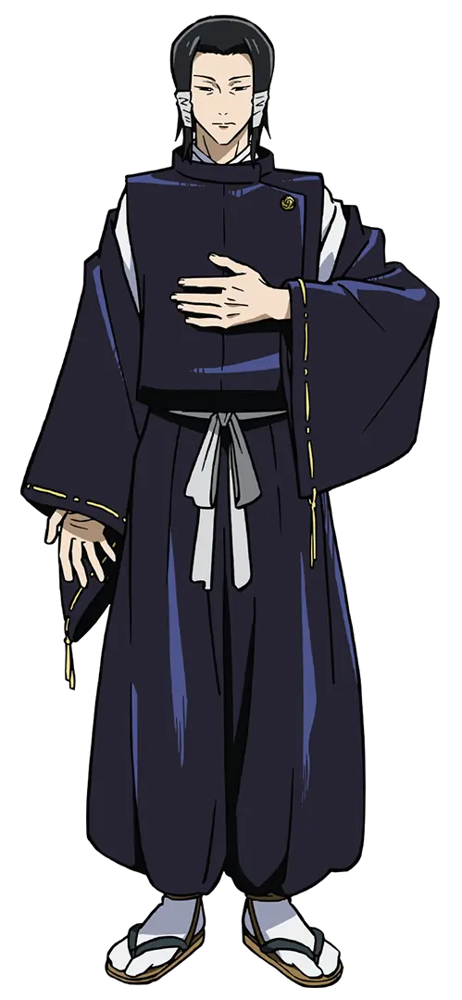
  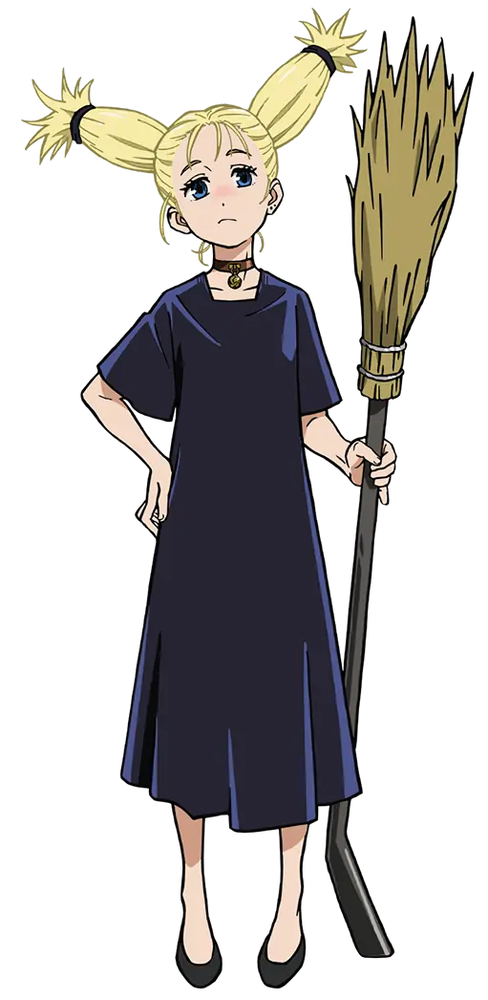
</div>

## Klans

### Gojo

Tags: `Gojo`, `Gosanke`

Die Gojo-Familie stammt von Michizane Sugawara ab, einem legendären Jujuzisten aus der Heian-Ära, der nach seinem Tod einer der drei großen Rachegeister Japans wurde. Ihre primäre geerbte Technik ist die Unendlichkeit zusammen mit den Six Eyes, dem mächtigsten Jujutsu der Geschichte.

#### Six Eyes

Tags: `Six Eyes`

Die Six Eyes sind ein sehr seltenes Augen-Jujutsu, welches innerhalb der Gojo-Familie vererbt wird. Es verleiht dem Anwender eine außergewöhnliche Wahrnehmung und die Fähigkeit, die [Grenzenlos](#grenzenlos) Fluchtechnik in vollem Umfang zu nutzen. Satoru Gojo ist der erste Jujuzist, der in den letzten hundert Jahren sowohl mit [Grenzenlos](#grenzenlos) als auch mit den Six Eyes geboren wurde.

Zwar kann jedes Mitglied der Gojo-Familie das [Grenzenlos](#grenzenlos) erben, aber nur wer auch die Six Eyes besitzt, kann die Kraft der Technik wirklich beherrschen.

Mit den Six Eyes reduziert sich die Menge an benötigter Fluchkraft jeder Technik auf `1`.

### Inumaki

Tags: `Inumaki`

Die Familie Inumaki ist eine von vielen kleineren Jujuzisten-Familien. Obwohl sie nicht als großer Klan gelten, ist die vererbte Technik der Inumaki, die Fluchrede, sehr angesehen. Man erkennt sie am Siegel der Inumaki-Familie, den "Schlangenaugen und Reißzähnen", die um den Mund eines Anwenders der Fluchrede entstehen.

### Kamo

Tags: `Kamo`, `Gosanke`

Die Kamo-Familie schätzt Blutsbande unermesslich, aber wie bei der Zenin-Familie hat die Weitergabe der überlieferten Technik oberste Priorität. Noritoshi Kamo wurde als Sohn einer Mätresse geboren, die misshandelt und von keinem Mitglied der Familie akzeptiert wurde. Dennoch wurde Noritoshi mit der vererbten Technik der Familie geboren: Blutmanipulation. Eine Fähigkeit, die für ihr allgemeines Gleichgewicht gepriesen wird und die perfekt für Menschen geeignet ist, die Blut schätzen. Die eigentliche Frau des Familienoberhaupts konnte keinen Sohn gebären, der diese Technik geerbt hätte, und so wurde Noritoshi als Erbe ausgewählt. Um seine Mutter zu schützen, fühlt sich Noritoshi gezwungen, sich so zu verhalten, wie es dem Klan angemessen ist.

Die Kamo-Familie ist auch für das größte Übel der Großen Drei Jujuzisten-Familien verantwortlich. Noritoshi Kamo, der als der böseste Jujuzist der Geschichte gilt, führte in einer vergangenen Ära Experimente an Menschen und verfluchten Geistern durch, die im Wesentlichen zu dem verfluchten Schoß führten: Death Paintings. Sein eigenes Blut wurde der gemischten DNA der ursprünglichen Eltern der Death Paintings zugefügt. Als die Nummern 1 bis 3 inkarniert waren, besaßen sie die angeborenen Techniken, die sich um die Verwendung ihres eigenen Blutes drehten. Insbesondere Choso hat die Blutmanipulation selbst geerbt und ist ihr im Vergleich zu Noritoshi, dem Schüler, überlegen.

### Zenin

Tags: `Zenin`, `Gosanke`

Die Familie Zenin verkörpert alle edlen Werte eines großen Klans. Sie glauben, dass mächtige Fluchtechniken wichtiger sind als alles andere und sind sogar bereit, Mitglieder der Familie auszustoßen, wenn sie diese nicht besitzen. Die problematischen Ideale des Klans wurden von Naobito Zenin, dem Oberhaupt der Familie für einige Zeit vor dem Ende des Jahres 2018, aufrechterhalten. Er pflegte ein schlechtes Verhältnis zur Gojo-Familie und grenzte Maki und Mai offen aus, weil sie als weibliche Jujuzisten nicht stark genug waren.

### Andere Klans

Wähle einen beliebigen Familien- / Klannamen, der nicht einem der oben genannten entspricht.

## Fluchtechniken

Jeder Jujuzist verfügt über eine Fluchtechnik. Eine Fluchtechnik kann von einem Klan vererbt werden, daneben gibt es Fluchtechniken, die keine weiteren Voraussetzungen haben.

Zusätzlich zur Fluchtechnik können Fähigkeiten erlernt werden, die nicht von einer Fluchtechnik abhängig sind. Jede Fähigkeit muss einzeln erlernt und geübt werden.

Beim erfolgreichen Verwenden deiner Fluchtechnik steigt deine Erfahrung um 1.

### Fluchrede


Voraussetzungen: `Inumaki`

Die Fluchede ist eine vererbte Technik der Inumaki-Familie. Sie verstärkt die Worte des Anwenders mit Fluchkraft, die die Zuhörer zwingt, auf der Grundlage dieser Worte zu handeln oder gehandelt zu werden.

Fluchrede wird aktiviert, wenn der Anwender Worte oder Befehle laut ausspricht. Diese Aktion zwingt den Zuhörer zu einer Handlung oder zu einer Befehlsausführung. So kann ein Anwender der Fluchrede seinem Gegner zum Beispiel befehlen, sich nicht mehr zu bewegen, zerquetscht zu werden oder zu sterben. Wie stark der Zwang ist, hängt von der Fluchkraft ab, die der Anwender in die Technik steckt.

Die Kraft kann zwar reguliert werden, aber sie kann nicht vollständig abgeschaltet werden. Der Anwender kann die Fluchrede nicht auf sich selbst anwenden. Das Ziel muss über eine Art von Gehör verfügen, um die Worte des Anwenders aufzunehmen. Die Bedeutung der Wörter muss das Ziel nicht verstehen können.

#### Einsatz

Der Einsatz der Fluchrede funktioniert etwas anders als bei anderen Fluchtechniken.

Überlege dir einen Befehl und spreche ihn aus. Du kannst dem GM die Macht des Befehls vorschlagen, tust du das nicht, bestimmt der GM die Macht deines Befehlt.

Du kannst den Einsatz der Fluchrede nur dann zurücknehmen, wenn du als Spieler eine Macht deines Befehlt vorgeschlagen hast und der GM damit nicht einverstanden ist.

Die Macht eines Befehls misst sich wie folgt:

| Beispiel                 | Macht |
| ------------------------ | ----- |
| Lebe                     | 20    |
| Stirb                    | 10    |
| Werde zerquetscht        | 8     |
| Falle                    | 7     |
| Erkranke an einer Grippe | 5     |
| Bewege dich nicht        | 2     |
| Lauf                     | 2     |
| Lass das fallen          | 1     |
| Schau weg                | 1     |

Die benötigte Fluchkraft ist abhängig vom Rang des mächtigsten Ziels in Reichweite und der Macht des Befehls.

| Rang des Ziels  | Fluchkraft  |
| --------------- | ----------- |
| Rang 4          | Macht x 3   |
| Rang 3          | Macht x 5   |
| Zwischen-Rang 2 | Macht x 6   |
| Rang 2          | Macht x 7   |
| Zwischen-Rang 1 | Macht x 8   |
| Rang 1          | Macht x 9   |
| Sonderrang 1    | Macht x 10  |
| Sonderrang      | Individuell |

Verwendest du die Fluchrede und kannst die benötigte Fluchkraft nicht aufbringen, fällt deine Kraft auf dich zurück und du erleidest Schaden in höhe der halben aufgebrachten Fluchkraft.

Übersteigt die benötigte Fluchkraft die Fluchkraft, die du aufbringen kannst, um das doppelte, erleidest du Schaden in Höhe der benötigten Fluchkraft.

Um Fluchkraft aufzubringen, musst du nicht würfeln. Du bist alleine dafür verantwortlich, einzuschätzen, welche Worte du verwenden kannst.

### Grenzenlos (無下限, Mukagen)

Voraussetzungen: `Gojo`

#### Neutrale Grenzenlosigkeit: Unendlichkeit (無限大, Bugendai)

Die Unendlichkeit ist die Konvergenz einer unermesslichen Reihe, alles, was sich der Unendlichkeit nähert, verlangsamt sich und erreicht den Anwender nie. Das liegt daran, dass die Technik den endlichen Raum zwischen den beiden Subjekten unendlich oft teilt.

Kostet immer 4 Fluchkraft und ist nicht steigerbar (Steigerung sntspricht dem Jujutsu Blau).

#### Blau (蒼, Ao)

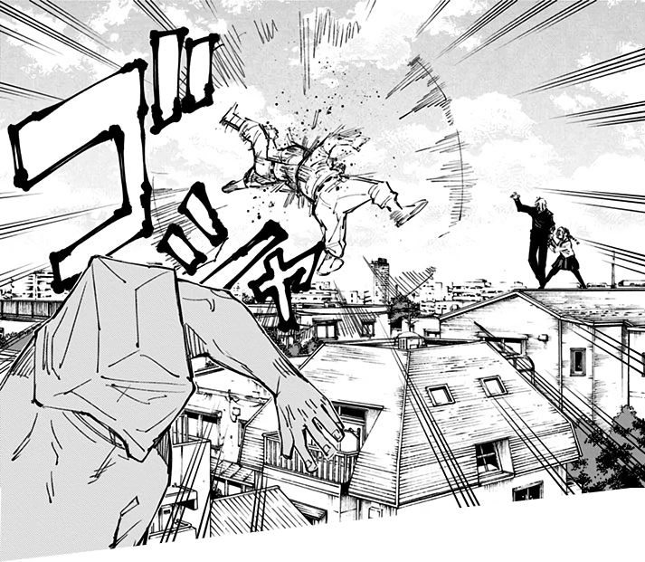

Du musst in Unendlichkeit einer Erfahrung von mindestens `10` haben.

Blau verstärkt Unendlichkeit und bringt die Unmöglichkeit des negativen Raumes in die Realität. Dies zwingt den umgebenden Raum, zu versuchen, die Lücke zu füllen, indem er gewaltsam in Richtung der Quelle der genannten Unmöglichkeit gedrückt wird, wodurch eine art magnetischer Effekt entsteht.

Bei jedem, der direkt mit Blau getroffen wird, implodiert der Körper und die Gliedmaßen werden sofort zerquetscht. Der Anwender kann diesen Effekt nutzen, um sich selbst mit hoher Geschwindigkeit zu bewegen oder massive Mengen verfluchter Energie aufbringen, um ein großes Anziehungsfeld von sich weg zu erzeugen. Stärkere Variationen von Blau können verwendet werden, um sich schneller bewegende Ziele oder große Gebiete anzuvisieren.

<table><thead>
<tr><th>Schwellwert</th><td>24</td></tr>
</thead></table>

#### Umkehrtechnik Rot (赫, Aka)


Kehrt die Wirkung von Blau um und bringt die Divergenz der Unendlichkeit in die Realität und erzeugt die Kraft des Abstoßens.

Dies wird erreicht, indem positive Fluchkraft in die Kraft von Grenzenlos geleitet, wodurch eine abstoßende anstatt einer magnetischen Wirkung entsteht.

Bedenke, dass der Schaden die hälfte der investierten Fluchkraft beträgt, da es sich um eine Umkehrtechnik handelt.

<table><thead>
<tr><th>Schwellwert</th><td>32</td></tr>
</thead></table>

#### Hohles Purpur (虚式「茈」, Kyoshiki・Murasaki)

<div class="gif" style="--screen: url(img/Hollow_Purple.webp);--print:url(img/Hollow_Technique_Purple.webp)"></div>

Purpur ist die Verschmelzung von Rot und Blau, eine geheime Fähigkeit, die nur wenigen in der Gojo-Familie bekannt ist. Sie steht für Bewegung und Umkehrung, eine Verschmelzung von Konvergenz und Divergenz, die beide Unendlichkeiten aufeinanderprallen lässt, um eine imaginäre Masse zu erzeugen. Der Effekt enthebt das Ziel der Realität und löscht alles, was die Technik trifft, sofort und ausnahmslos aus.

Kamehameha ist ein Witz dagegen 😉.

<table><thead>
<tr><th>Schwellwert</th><td>75</td></tr>
<tr><th>Effekt</th><td>Auslöschung</td></tr>
</thead></table>

Diese Technik macht keinen Schaden, die löscht aus. Steigerung ist in der Fläche des Angriffs möglich.

#### Sphären-Entfaltung: Grenzenlose Leere

In dieser Sphäre gefangene werden mit allen Informationen des gesamten Universums überladen. Sie sind vollständig handlungsunfähig.

<table><thead>
<tr><th>Macht</th><td>20</td></tr>
<tr><th>Effekt</th><td>Betäuben 30 auf alle Gegner</td></tr>
</thead></table>

### Zehn Schatten Technik

Voraussetzungen: `Zenin`

Die Zehn-Schatten-Technik ist eine vererbte Technik, die in der Zenin-Familie weitergegeben wird. Durch die Verwendung von Schatten als Medium erlaubt diese Technik dem Anwender, zehn verschiedene Shikigami zu beschwören.

Wenn jemand die Zehn-Schatten-Technik erbt, erhält er zwei göttliche Hunde. Andere Shikigami können mit einem Exorzismus-Ritual beschworen werden, bei dem der Anwender die Shikigami besiegen muss, um sie zu unterwerfen.

Einmal beherrscht, stehen die Shikigami unter der vollen Kontrolle ihres Meisters und können mit Handzeichen beschworen werden, die eine Schattenfigur des jeweiligen Vertrauten erzeugt. Die Schatten fungieren als Medium für die Shikigami-Beschwörung, indem sie die Form der Shikigami aus greifbaren, flüssigen Schatten mit Hilfe von Fluchkraft manifestieren. Nachdem der Anwender weitere Vertraute gewonnen hat, kann er den rituellen Prozess wiederholen, um bis zu zehn verschiedene Shikigami zu beschwören und zu sammeln.

Du zahlst die Kosten, wenn ein Shikigami Fluchkraft einsetzt. Jedoch verbrauchst du nur 75% der Fluchkraft, die dein Gegner abbekommt.

#### Gyokuken

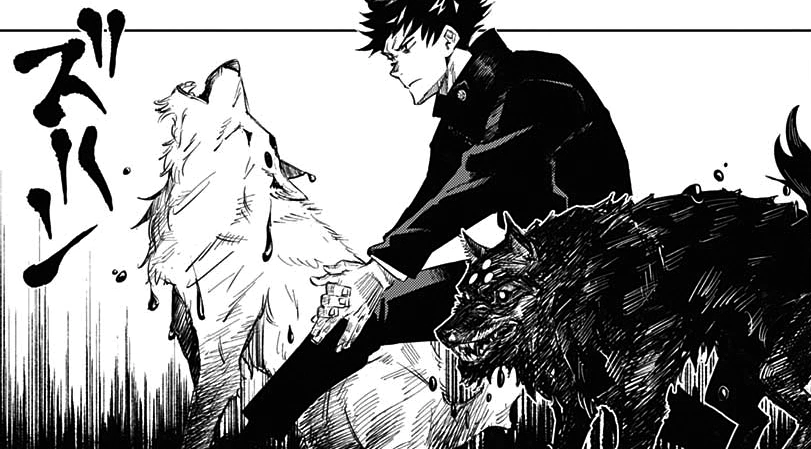

Die zwei Wolfe sind Zwillinge, jeder der beiden verfügt über 20 Trefferpunkte. Sie gelten als eine Beschwörung. Stirbt einer der beiden, erbt der andere seine vollständige Kraft (Angriffsstärke und Kosten verdoppeln sich).

Die Beschwörung kostet 8 Fluchkraft.

| Fähigkeit | Schwellwert | Reichweite |
| --------- | ----------- | ---------- |
| Klauen    | 8           | Berührung  |
| Biss      | 10          | Berührung  |

#### Nue

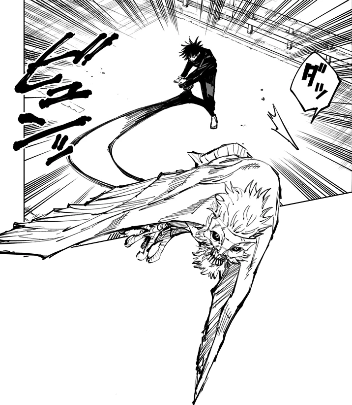

Nue ist ein vogelähnliches Wesen mit orangefarbenen Federn und einem weißen, maskenähnlichem Gesicht. Es hat große Flügel, zwei Sätze von Krallen und menschenähnliche Zähne.

Nue ist ein vielseitiges Shikigami, vor allem wegen seiner erweiterten Mobilität, die es durch seine Fähigkeit zu fliegen erhält. Es verfüht über 50 Trefferpunkte.

Die Beschwörung kostet 20 Fluchkraft.

| Fähigkeit   | Schwellwert | Reichweite | Effekt       |
| ----------- | ----------- | ---------- | ------------ |
| Blitzflügel | 24          | 20 Meter   | `Betäuben 3` |
| Blitzflügel | 28          | Berührung  | `Betäuben 4` |

#### Gama

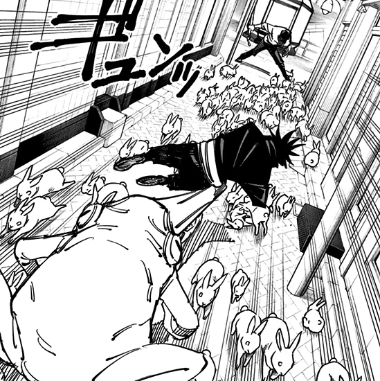

Gama ist eine menschengroße Kröte mit Zeichen um den Augen und einem Symbol auf dem Bauch, das dem Spiegel der Tiefe der zehn heiligen Schätze ähnelt. Es verfügt über 35 Trefferpunkte.

Die Beschwörung kostet 15 Fluchkraft.

| Fähigkeit    | Schwellwert | Reichweite |
| ------------ | ----------- | ---------- |
| Zungenschlag | 12          | 50 Meter   |

#### Seiteishirazu

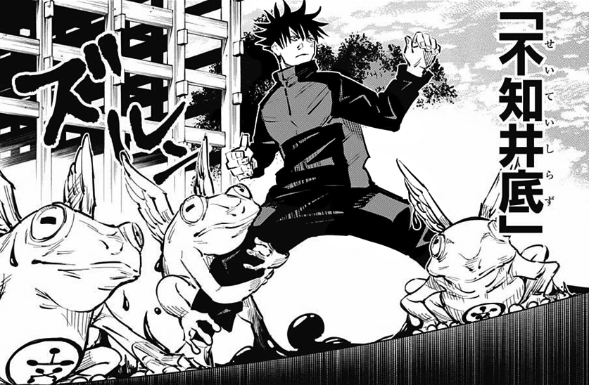

Die Beschwörung kostet 10 Fluchkraft und verfügt über 25 Trefferpunkte.

Kombiniert das Nue- und das Gama-Shikigami, um eine Vielzahl geflügelter Kröten zu erschaffen, die schwächer sind als die ursprünglichen Kröten, aber ohne Folgen zerstört werden können.

| Fähigkeit    | Schwellwert | Reichweite |
| ------------ | ----------- | ---------- |
| Zungenschlag | 10          | 35 Meter   |

#### Orochi

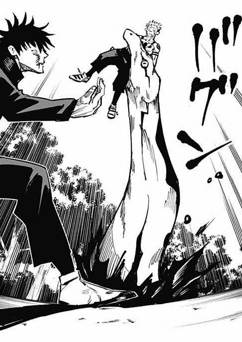

Die Beschwörung kostet 20 Fluchkraft und verfügt über 60 Trefferpunkte.

| Fähigkeit    | Schwellwert | Reichweite | Effekt     |
| ------------ | ----------- | ---------- | ---------- |
| Zerquetschen | 24          | Kontakt    | -          |
| Biss         | 30          | Kontakt    | Betäuben 6 |

#### Banshō

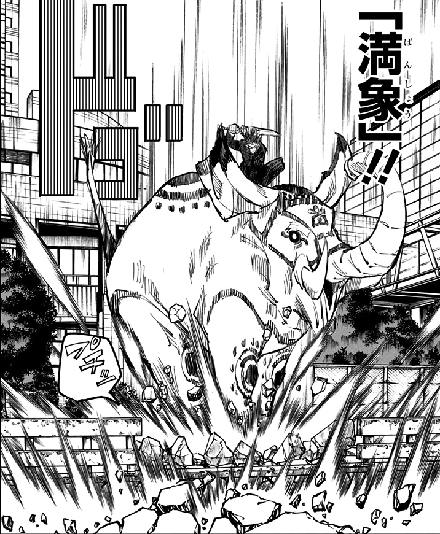

Banshō ist ein Elefanten-Shikigami, das große Mengen an Wasser aus seinem Rüssel spucken kann. Es kann auch verwendet werden, um das Ziel seines Meisters mit seinem Gewicht zu zerquetschen. Allerdings kostet seine Beschwörung im Vergleich zu anderen Shikigami eine Menge Fluchkraft.

Die Beschwörung kostet 50 Fluchkraft und verfügt über 120 Trefferpunkte.

| Fähigkeit             | Schwellwert | Reichweite | Effekt     |
| --------------------- | ----------- | ---------- | ---------- |
| Reißende Wasserströme | 80          | 50 Meter   | Betäuben 1 |
| Wildes Stampfen       | 80          | Kontakt    | Betäuben 3 |

#### Datto


Datto ist ein Schwarm aus unzähligen Kaninchen-Shikigami. Jedes Kaninchen kostet 2 Fluchkraft und verfügt über 5 Trefferpunkte.

Im Gegensatz zu vielen anderen Shikigami der Zehn-Schatten-Technik können Kaninchen weiterhin in großer Zahl produziert werden, unabhängig davon, wie viele von ihnen zerstört werden.

Die Stärke dieser Shikigami ist, dass sie in großen Shaaren verwendet werden und sich schnell bewegen können.

| Fähigkeit  | Schwellwert | Reichweite |
| ---------- | ----------- | ---------- |
| Zahnklinge | 2           | Kontakt    |

#### Yatsuka-no-Tsurugi Ikaishinshō Makora (kurz Mahoraga)

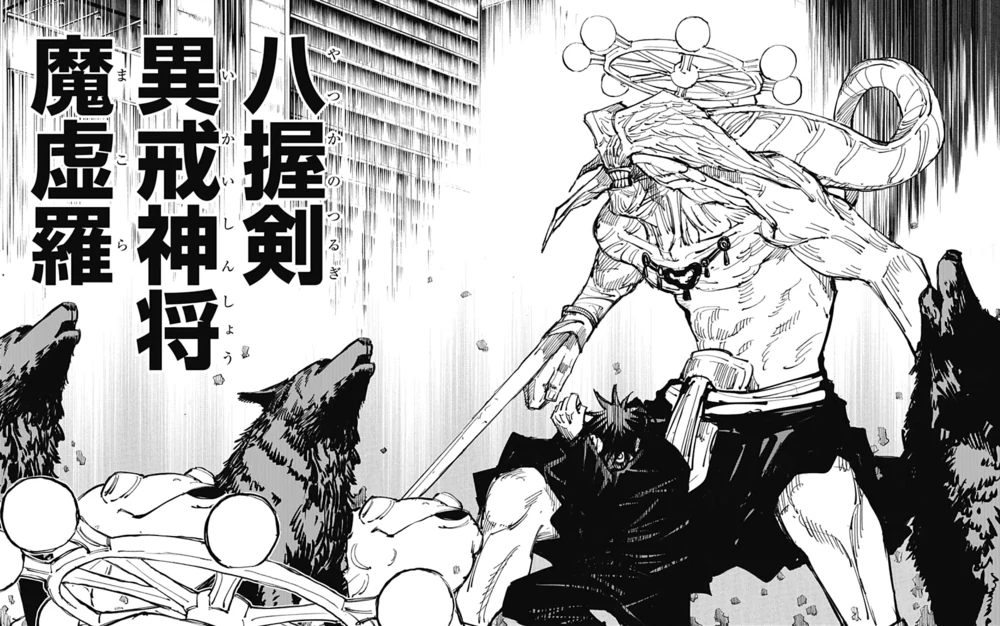

Dieser ist der mächtigste Shikigami der Zehn-Schatten-Technik. In seiner gesamten Geschichte hat es kein Anwender der Zehn-Schatten-Technik geschafft, ihn zu bändigen.

Der Shikigami selbst ist eine hoch aufragende, muskulöse humanoide Figur mit vier Flügeln, die aus den Augenhöhlen ragen, und einem schwanzähnlichen Anhängsel, das aus dem Hinterkopf herausragt. Direkt darüber schwebt ein großes Rad mit acht Griffen, das sich dreht, wenn Mahoraga auf neue Reize reagiert. Furus Beschwörung der zehn heiligen Schätze und dieses Rad stehen für einen vollständigen Zyklus und Harmonie. Mahoraga trägt außerdem eine schwarze Hakama-Hose und eine weiße Schärpe um seine Taille, die den größten Teil seines Unterkörpers bedeckt.

Der Göttliche General besitzt die Fähigkeit, sich an alle Phänomene anzupassen. Wenn er durch einen bestimmten Angriff verletzt wird, dreht sich das achtarmige Rad und erlaubt ihm, sich anzupassen. Wenn sein Gegner dieselbe Technik erneut anwendet, kann Mahoraga sie kontern. Dies funktioniert auch in der Offensive, indem er sich dem Angriff anpasst, um die Verteidigung des Gegners effizient zu durchbrechen.

Außerdem hat der Mahoraga die Kraft, Beton zu zerschlagen oder jemanden mit einem einzigen Schlag durch mehrere Gebäude zu schlagen. Er schwingt auch das Schwert der Vernichtung, eine Klinge, die an seinem Unterarm befestigt ist und von positiver Energie umhüllt wird, was sie besonders effektiv gegen verfluchte Geister macht.

Mahoraga zu beschwören kostet keine Fluchkraft, aber es ist sehr schwierig, ihn zu kontrollieren. Wenn er beschworen wird, verfügt er über 1000 Trefferpunkte.

| Fähigkeit   | Schwellwert | Reichweite |
| ----------- | ----------- | ---------- |
| Schlag      | 60          | Kontakt    |
| Schwerthieb | 100         | Kontakt    |

## Fähigkeiten

Zusätzlich zur Fluchtechnik können Fähigkeiten erlernt werden, die nicht von einer Fluchtechnik abhängig sind. Jede Fähigkeit mus einzeln erlernt und geübt werden.

Du kannst Aspekte deiner Fluchtechnik mit deinen Fähigkeiten kombinieren und umgekehrt. Dazu musst du dem GM allerdings plausibel erklären, wie das funktionieren soll. Ihr verhandelt dann über die Auswirkungen dieser Kombination.

Beim erfolgreichen Verwenden einer Fähigkeit steigt deine Erfahrung um einen Punkt.

## Fluchkraft

Um eine Jujutsu anwenden zu können, benötigst du die nötige Menge an Fluchkraft, diese entsteht hauptsächlich aus negativen Emotionen.

Ein Jujuzist lernt mit der Zeit aus jeder Art von Emotion Fluchkraft zu generieren.

Zu Beginn einer Scene, in der du Fluchkraft verwenden willst, musst du diese zuerst generieren. Würfle dazu:

```
Fluchkraft = 24 + Erfahrung / (D6 + D4)
```

Je mehr Fluchkraft du in dein Jujutsu steckst, desto stärker ist die Wirkung. Die meißten Jujutsus haben eine Kraftschwelle, das ist eine bestimmte Menge an Fluchkraft, die du investieren musst, um das Jujtsu überhaupt anwenden zu können. Alles, was du darüber hinaus investierst, steigert die Wirkung.

### Negative Fluchkraft einsetzen

Würfle die Menge an Fluchkraft, die du aufbringst, um sie einzusetzen. Nach jedem Wurf entscheidest du, ob du weiter würfelst (mehr Fluchkraft aufbringst) oder nicht.

Du entscheidest selbst, welchen Würfel du verwendest. Du darfst aber nur einmal den Würfel wechseln.

Wenn du die gewürfelte Menge an Fluchkraft nicht aufbringen kannst, verwendest du deine gesamte Fluchkraft, beim Ziel kommt aber nur die hälfte davon an.

Subtrahiere die aufgebrachte Menge an Fluchkraft von dem was dir aktuell zur Verfügung steht und teile deinem GM mit, wie viel Fluchkraft beim Ziel ankommt.

### Umkehrtechnik, Positive Fluchkraft einsetzen

Du musst in einem Jujutsu `500 Erfahrung` haben, um es als Umkehrtechnik anwenden zu können.

Eine Umkehrtechnik kann mit jedem Jujutsu genutzt werden, das du beherschst. Damit kannst du eine gegenteilige Wirkung erzielen wie normalerweise.

Um eine Umkehrtechnik anzuwenden, benötigst du die doppelte Menge an Fluchkraft, die du für die normale Anwendung benötigst. Du kombinierst nämlich zwei negative Fluchkräfte miteinander.

Würfle zweimal für [negative Fluchkraft](#negative-fluchkraft-einsetzen). Die Menge an Fluchkraft, die beim Ziel ankommt, ist die kleinere Summe minus die Differenz beider Summen.

Wenn du also `56` und `42` würfelst, verbrauchst du `98` (`56 + 42`). Beim Ziel kommt dann `28` an (`42 - |56 - 42|`).

Ist dieses Jujutsu noch nicht als Umkehrtechnik definiert worden, erkläre plausibel wie sich die positive Fluchkraft darauf auswirkt.

### Hollow

Du musst in einem Jujutsu mindestens `5000 Erfahrung` haben, um es als Hollow anwenden zu können.

Du kannst negativ und positiv kombinieren, um eine Hollow-Technik anzuwenden.

<div class="gif" style="--screen: url(img/Satoru_Gojo_activating_Red_and_Blue.webp);--print:url(img/Satoru_Gojo_activating_Red_and_Blue_Manga.webp)"></div>

Du würfelst insgesamt drei Techniken. Zum Beispiel:

`132`, `160` und `178`.

Der erste Wurf ist die negative Fluchkraft, der zweite und dritte ergeben die Umkehrtechnik.

Damit ergibt sich eine negative Technik mit einer Stärke von `132` und dem selben Verbrauch. Dazu kommt eine Unkehrtechnik mit einer Stärke von `142` (`160 - |178-160|`) mit einem Verbrauch von `338` (`160 + 178`).

Das kombiniert sich zu einer Hollow-Technik mit einer Stärke von `274` (`132 + 142`) und einem Verbrauch von `470` (`132 + 338`).

Entscheide (logisch schlüssig), wie sich die beiden Fluchkraftarten aufeinander auswirken und was dabei passiert.

### Sphären-Entfaltung

Die Sphären-Entfaltung ist eine fortgeschrittene Barrieretechnik, welche die innere Sphäre des Anwenders manifestiert und das Ziel mit Hilfe einer Barrierewand in ihr gefangen hält, um einen separaten Raum zu schaffen. Im Inneren trifft der Eigentümer der Sphäre immer.

Eine Sphäre kann durch eine stärkere zurückgedrängt werden. Von innen ist sie unzerstörbar. Von außen kann man mit etwas Kraftaufwand ein Loch in die Barriere schlagen.

Teleportation aus einer Sphäre heraus ist nur dem Eigentümer möglich, dabei kann die Sphäre allerdings nicht mehr aufrecht erhalten werden.

Jede Sphären-Entfaltung ist ab einer Erfahrung von `5000` für die [Fluchtechnik](#fluchtechniken) möglich.

## Trefferpunkte

Ein Spieler startet mit `6 D12` Trefferpunkten.

Einmal ausgewürfelt, können diese nur durch sonder-Events oder Training verändert werden.

Bei einem Fluchkraftangriff wird die Menge an Fluchkraft, die beim Ziel ankommt, von dessen Trefferpunkten abgezogen. Bei einem rein physischen Angriff wird die Menge an Schaden, die beim Ziel ankommt, von dessen Trefferpunkten abgezogen.

Fällt ein Spieler auf `0` oder weniger Trefferpunkte, wird er Bewustlos.

Fällt ein Spieler auf den Negativwert seiner eigenen Trefferpunkte, stirbt er.

## Aktionen

Zu Beginn einers Kampfes würfelt jeder Spieler seine Initiative. Der Spieler mit der höchsten Initiative beginnt, der Rest volgt absteigent. Bei gleichem Ergebmis folgt ein Stechen.

Wenn ein Mitstreiter getroffen würde, kannst du darauf reagieren. Du kannst dann eine Aktion vorziehen, die du normalerweise erst in der nächsten Runde machen würdest. Deine Aktion muss allerdings dazu dienen den Angriff abzuwehren, zu verhindern oder ähnliches.

### Sonderaktionen

Du kannst deine Aktion dazu nutzen um eine Sonderaktion durchzuführen, anstatt eines Jujutsus.

#### Fluchkraft generieren

Würfle wie zu Beginn, gezeigt im Kapitel [Fluchkraft](#fluchkraft).

#### Beobachten

Beobachte eine Kratur um Informationen über ihre Technik zu erhalten.

## Training

Beim Training kannst du dich verbessern. Erhöhe deine Erfahrung in deiner Fluchtechnik oder einer Fähigkeit um einen `D6`.

Du kannst auch deinen Körper trainieren. Erhöhe deine Trefferpunkte um einen `D6`.

Wenn du mit einem Lehrer oder ranghöheren trainierst, erhöht dieser dein Trainingsergebnis einen `D4`.

## Effekte

Ein Jujutsu kann dem Ziel Effekte hinzufügen. Manche Effekte, wie `Brennen`, sind auch auf Gegenstände anwendbar.

### Macht

Ein Effekt hat meißtens eine bestimmte Macht. `Betäuben 3` ist zum Beispiel der `Betäuben` Effekt mit einer Macht von `3`. Generell gilt `1` als sehr schwach und `10` als sehr stark.

### Mehrere Effekte

Wird mehrmals der selbe Effekt auf ein Ziel angewendet, wird der Effekt eventuell stärker. Es gilt der Effekt mit der größten Macht.

### Widerstehen

Wenn du eine [Umkehrtechnik](#umkehrtechnik-positive-fluchkraft-einsetzen) mit einer positiven Fluchkraft des zwanzigfachen der Macht des Effektes wirkst, kannst du den Effekt abwehren, bevor er wirkt. Das gilt nicht als Aktion.

### Befreien

Um dich von einem Effekt zu befreien, musst du einen Wurf für eine [Umkehrtechnik](#umkehrtechnik-positive-fluchkraft-einsetzen) auf das zehnfache der Macht des Effektes werfen. Wenn du erfolgreich bist, bist du von dem Effekt befreit.

Für `Betäuben 3` müsstest du also eine [Umkehrtechnik](#umkehrtechnik-positive-fluchkraft-einsetzen) mit einer positiven Fluchkraft von `30` oder mehr werfen.

Auch andere können dich befreien, dafür gelten die selben Bedingungen wie für dich selbst.

Einige Jujutsus können Effekte aufgrund von Logik befreien. Zum Beispiel kann Wasser den `Brennen` Effekt befreien.

### Betäuben

Deine einzige mögliche Aktion ist der Versuch dich zu befreien.

### Verwirren

Beim Würfeln für das verwenden von Fluchkraft, darfst du nich die Würfel wechseln.

### Auslöschung

Deine Existens wird ausradiert. Du bist tot, ohne Aussicht auf Rettung.

## Brennen

Du erhälst nach jeder Runde Raden in Höhe der Macht des Effektes.

<link href="style.css" rel="stylesheet" />
