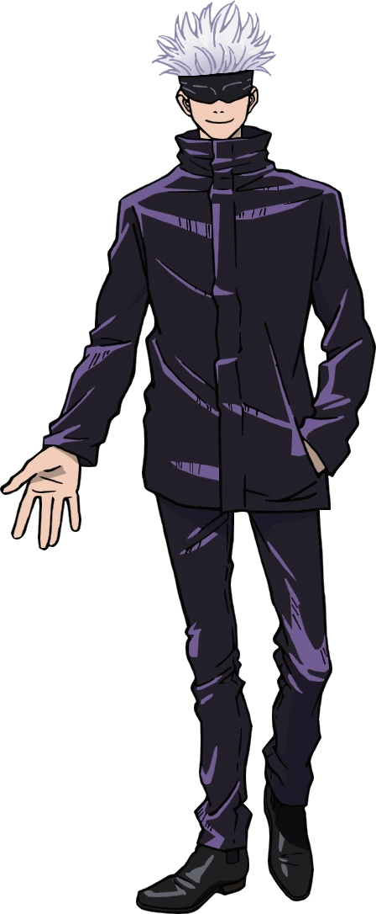

# Regelwerk

## Tags

Die Beschreibung deines Charakters basiert auf Tags. Widersprüchliche Tags können nicht kombiniert werden. Diese Tags beeinflussen größtenteils das Rollenspiel. Wenige Tags beeinflussen Spielmechaniken.

### Voraussetzungen

Während der Charaktererstellung wirst du auf Voraussetzungen stoßen. Zum Beispiel hat die [Fluchtechnik](#fluchtechniken) [Fluchrede](#fluchrede) die Voraussetzung `Inumaki`, diesen Tag bekommst du, wenn du dem [Inumaki Klan](#inumaki) angehörst.

## Erfahrung

Wärend der Kampagne erhält dein Charakter Erfahrung. Für dieses Regelwerk ist vorgesehen, dass die möglichen Erfahrungspunkte von 0 bis 10000 reichen.

## Charaktererstellung

1. Wähle einen **[Klan](#klans)**.
   Dieser bestimmt auch einen Großteil deiner Vergangenheit, wenn du dich für eine der drei großen Klans (Gojo, Kamo und Zenin) entscheidest.
1. Passe deinen **Hintergrund** an.
   Gebunden an das, was dein Klan dir vorgibt, kannst du deinen Hintergrund frei wählen.
1. Passe deine **[Uniform](#uniform)** an

## Uniform

Wenn du möchtest, kannst du Details deiner Uniform ändern lassen.

### Standard

### Anpassungen

  
  
  
  
  
  
  

## Klans

### Gojo

Tags: `Gojo`, `Gosanke`

Die Gojo-Familie stammt von Michizane Sugawara ab, einem legendären Jujuzisten aus der Heian-Ära, der nach seinem Tod einer der drei großen Rachegeister Japans wurde. Ihre primäre geerbte Technik ist die Unendlichkeit zusammen mit den Six Eyes, dem mächtigsten Jujutsu der Geschichte.

### Inumaki

Tags: `Inumaki`

Die Familie Inumaki ist eine von vielen kleineren Jujuzisten-Familien. Obwohl sie nicht als großer Klan gelten, ist die vererbte Technik der Inumaki, die Fluchrede, sehr angesehen. Man erkennt sie am Siegel der Inumaki-Familie, den "Schlangenaugen und Reißzähnen", die um den Mund eines Anwenders der Fluchrede entstehen.

### Kamo

Tags: `Kamo`, `Gosanke`

Die Kamo-Familie schätzt Blutsbande unermesslich, aber wie bei der Zenin-Familie hat die Weitergabe der überlieferten Technik oberste Priorität. Noritoshi Kamo wurde als Sohn einer Mätresse geboren, die misshandelt und von keinem Mitglied der Familie akzeptiert wurde. Dennoch wurde Noritoshi mit der vererbten Technik der Familie geboren: Blutmanipulation. Eine Fähigkeit, die für ihr allgemeines Gleichgewicht gepriesen wird und die perfekt für Menschen geeignet ist, die Blut schätzen. Die eigentliche Frau des Familienoberhaupts konnte keinen Sohn gebären, der diese Technik geerbt hätte, und so wurde Noritoshi als Erbe ausgewählt. Um seine Mutter zu schützen, fühlt sich Noritoshi gezwungen, sich so zu verhalten, wie es dem Klan angemessen ist.

Die Kamo-Familie ist auch für das größte Übel der Großen Drei Jujuzisten-Familien verantwortlich. Noritoshi Kamo, der als der böseste Jujuzist der Geschichte gilt, führte in einer vergangenen Ära Experimente an Menschen und verfluchten Geistern durch, die im Wesentlichen zu dem verfluchten Schoß führten: Death Paintings. Sein eigenes Blut wurde der gemischten DNA der ursprünglichen Eltern der Death Paintings zugefügt. Als die Nummern 1 bis 3 inkarniert waren, besaßen sie die angeborenen Techniken, die sich um die Verwendung ihres eigenen Blutes drehten. Insbesondere Choso hat die Blutmanipulation selbst geerbt und ist ihr im Vergleich zu Noritoshi, dem Schüler, überlegen.

### Zenin

Tags: `Zenin`, `Gosanke`

Die Familie Zenin verkörpert alle edlen Werte eines großen Klans. Sie glauben, dass mächtige Fluchtechniken wichtiger sind als alles andere und sind sogar bereit, Mitglieder der Familie auszustoßen, wenn sie diese nicht besitzen. Die problematischen Ideale des Klans wurden von Naobito Zenin, dem Oberhaupt der Familie für einige Zeit vor dem Ende des Jahres 2018, aufrechterhalten. Er pflegte ein schlechtes Verhältnis zur Gojo-Familie und grenzte Maki und Mai offen aus, weil sie als weibliche Jujuzisten nicht stark genug waren.

### Andere Klans

Wähle einen beliebigen Familien- / Klannamen, der nicht einem der oben genannten entspricht.

## Fluchtechniken

Jeder Jujuzist verfügt über eine Fluchtechnik. Eine Fluchtechnik kann von einem Klan vererbt werden, daneben gibt es Fluchtechniken, die keine weiteren Voraussetzungen haben.

Zusätzlich zur Fluchtechnik können Fähigkeiten erlernt werden, die nicht von einer Fluchtechnik abhängig sind. Jede Fähigkeit muss einzeln erlernt und geübt werden.

Beim erfolgreichen Verwenden deiner Fluchtechnik steigt deine Erfahrung um 1.

### Fluchrede

Voraussetzungen: `Inumaki`

Die Fluchede ist eine vererbte Technik der Inumaki-Familie. Sie verstärkt die Worte des Anwenders mit Fluchkraft, die die Zuhörer zwingt, auf der Grundlage dieser Worte zu handeln oder gehandelt zu werden.

Fluchrede wird aktiviert, wenn der Anwender Worte oder Befehle laut ausspricht. Diese Aktion zwingt den Zuhörer zu einer Handlung oder zu einer Befehlsausführung. So kann ein Anwender der Fluchrede seinem Gegner zum Beispiel befehlen, sich nicht mehr zu bewegen, zerquetscht zu werden oder zu sterben. Wie stark der Zwang ist, hängt von der Fluchkraft ab, die der Anwender in die Technik steckt.

Die Kraft kann zwar reguliert werden, aber sie kann nicht vollständig abgeschaltet werden. Der Anwender kann die Fluchrede nicht auf sich selbst anwenden. Das Ziel muss über eine Art von Gehör verfügen, um die Worte des Anwenders aufzunehmen. Die Bedeutung der Wörter muss das Ziel nicht verstehen können.

#### Einsatz

Der Einsatz der Fluchrede funktioniert etwas anders als bei anderen Fluchtechniken.

Überlege dir einen Befehl und spreche ihn aus. Du kannst dem GM die Macht des Befehls vorschlagen, tust du das nicht, bestimmt der GM die Macht deines Befehlt.

Du kannst den Einsatz der Fluchrede nur dann zurücknehmen, wenn du als Spieler eine Macht deines Befehlt vorgeschlagen hast und der GM damit nicht einverstanden ist.

Die Macht eines Befehls misst sich wie folgt:

| Beispiel                 | Macht |
| ------------------------ | ----- |
| Lebe                     | 20    |
| Stirb                    | 10    |
| Werde zerquetscht        | 8     |
| Falle                    | 7     |
| Erkranke an einer Grippe | 5     |
| Bewege dich nicht        | 2     |
| Lauf                     | 2     |
| Lass das fallen          | 1     |
| Schau weg                | 1     |

Die benötigte Fluchkraft ist abhängig vom Rang des mächtigsten Ziels in Reichweite und der Macht des Befehls.

| Rang des Ziels  | Fluchkraft  |
| --------------- | ----------- |
| Rang 4          | Macht x 3   |
| Rang 3          | Macht x 5   |
| Zwischen-Rang 2 | Macht x 6   |
| Rang 2          | Macht x 7   |
| Zwischen-Rang 1 | Macht x 8   |
| Rang 1          | Macht x 9   |
| Sonderrang 1    | Macht x 10  |
| Sonderrang      | Individuell |

Verwendest du die Fluchrede und kannst die benötigte Fluchkraft nicht aufbringen, fällt deine Kraft auf dich zurück und du erleidest Schaden in höhe der halben aufgebrachten Fluchkraft.

Übersteigt die benötigte Fluchkraft die Fluchkraft, die du aufbringen kannst, um das doppelte, erleidest du Schaden in Höhe der benötigten Fluchkraft.

Um Fluchkraft aufzubringen, musst du nicht würfeln. Du bist alleine dafür verantwortlich, einzuschätzen, welche Worte du verwenden kannst.

### Zehn Schatten Technik

Voraussetzungen: `Zenin`

Die Zehn-Schatten-Technik ist eine vererbte Technik, die in der Zenin-Familie weitergegeben wird. Durch die Verwendung von Schatten als Medium erlaubt diese Technik dem Anwender, zehn verschiedene Shikigami zu beschwören.

Wenn jemand die Zehn-Schatten-Technik erbt, erhält er zwei göttliche Hunde. Andere Shikigami können mit einem Exorzismus-Ritual beschworen werden, bei dem der Anwender die Shikigami besiegen muss, um sie zu unterwerfen.

Einmal beherrscht, stehen die Shikigami unter der vollen Kontrolle ihres Meisters und können mit Handzeichen beschworen werden, die eine Schattenfigur des jeweiligen Vertrauten erzeugt. Die Schatten fungieren als Medium für die Shikigami-Beschwörung, indem sie die Form der Shikigami aus greifbaren, flüssigen Schatten mit Hilfe von Fluchkraft manifestieren. Nachdem der Anwender weitere Vertraute gewonnen hat, kann er den rituellen Prozess wiederholen, um bis zu zehn verschiedene Shikigami zu beschwören und zu sammeln.

Du zahlst die Kosten, wenn ein Shikigami Fluchkraft einsetzt.

#### Gyokuken

Die zwei Wolfe sind Zwillinge, jeder der beiden verfügt über 20 Trefferpunkte. Sie gelten als eine Beschwörung. Stirbt einer der beiden, erbt der andere seine vollständige Kraft (Angriffsstärke und Kosten verdoppeln sich).

Die Beschwörung kostet 8 Fluchkraft.

| Fähigkeit | Schaden | Reichweite | Kosten |
| --------- | ------- | ---------- | ------ |
| Klauen    | 4 D4    | Berührung  | 2 D6   |
| Biss      | 5 D4    | Berührung  | 4 D4   |

#### Nue

Nue ist ein vogelähnliches Wesen mit orangefarbenen Federn und einem weißen, maskenähnlichem Gesicht. Es hat große Flügel, zwei Sätze von Krallen und menschenähnliche Zähne.

Nue ist ein vielseitiges Shikigami, vor allem wegen seiner erweiterten Mobilität, die es durch seine Fähigkeit zu fliegen erhält. Es verfüht über 50 Trefferpunkte.

Die Beschwörung kostet 20 Fluchkraft.

| Fähigkeit   | Schaden      | Reichweite | Kosten | Effekt     |
| ----------- | ------------ | ---------- | ------ | ---------- |
| Blitzflügel | 4 D12        | 20 Meter   | 6 D6   | Betäuben 3 |
| Blitzflügel | 4 D12 + 2 D4 | Berührung  | 7 D6   | Betäuben 4 |

#### Gama

Gama ist eine menschengroße Kröte mit Zeichen um den Augen und einem Symbol auf dem Bauch, das dem Spiegel der Tiefe der zehn heiligen Schätze ähnelt. Es verfügt über 35 Trefferpunkte.

Die Beschwörung kostet 15 Fluchkraft.

| Fähigkeit    | Schaden | Reichweite | Kosten |
| ------------ | ------- | ---------- | ------ |
| Zungenschlag | 2 D12   | 50 Meter   | 3 D6   |

#### Seiteishirazu

Die Beschwörung kostet 10 Fluchkraft und verfügt über 25 Trefferpunkte.

Kombiniert das Nue- und das Gama-Shikigami, um eine Vielzahl geflügelter Kröten zu erschaffen, die schwächer sind als die ursprünglichen Kröten, aber ohne Folgen zerstört werden können.

| Fähigkeit    | Schaden     | Reichweite | Kosten |
| ------------ | ----------- | ---------- | ------ |
| Zungenschlag | 1 D12 + 1D4 | 35 Meter   | 2 D6   |

#### Orochi

Die Beschwörung kostet 20 Fluchkraft und verfügt über 60 Trefferpunkte.

| Fähigkeit    | Schaden | Reichweite | Kosten | Effekt     |
| ------------ | ------- | ---------- | ------ | ---------- |
| Zerquetschen | 4 D12   | Kontakt    | 2 D6   | -          |
| Biss         | 5 D12   | Kontakt    | 3 D12  | Betäuben 6 |

#### Banshō

Banshō ist ein Elefanten-Shikigami, das große Mengen an Wasser aus seinem Rüssel spucken kann. Es kann auch verwendet werden, um das Ziel seines Meisters mit seinem Gewicht zu zerquetschen. Allerdings kostet seine Beschwörung im Vergleich zu anderen Shikigami eine Menge Fluchkraft.

Die Beschwörung kostet 50 Fluchkraft und verfügt über 120 Trefferpunkte.

| Fähigkeit             | Schaden | Reichweite | Kosten | Effekt     |
| --------------------- | ------- | ---------- | ------ | ---------- |
| Reißende Wasserströme | 4 D20   | 50 Meter   | 3 D20  | Betäuben 1 |
| Wildes Stampfen       | 4 D20   | Kontakt    | 4 D12  | Betäuben 3 |

#### Datto

Datto ist ein Schwarm aus unzähligen Kaninchen-Shikigami. Jedes Kaninchen kostet 2 Fluchkraft und verfügt über 5 Trefferpunkte.

Im Gegensatz zu vielen anderen Shikigami der Zehn-Schatten-Technik können Kaninchen weiterhin in großer Zahl produziert werden, unabhängig davon, wie viele von ihnen zerstört werden.

Die Stärke dieser Shikigami ist, dass sie in großen Shaaren verwendet werden und sich schnell bewegen können.

| Fähigkeit  | Schaden | Reichweite | Kosten |
| ---------- | ------- | ---------- | ------ |
| Zahnklinge | 1 D4    | Kontakt    | 1 D4   |

#### Yatsuka-no-Tsurugi Ikaishinshō Makora (kurz Mahoraga)

Dieser ist der mächtigste Shikigami der Zehn-Schatten-Technik. In seiner gesamten Geschichte hat es kein Anwender der Zehn-Schatten-Technik geschafft, ihn zu bändigen.

Der Shikigami selbst ist eine hoch aufragende, muskulöse humanoide Figur mit vier Flügeln, die aus den Augenhöhlen ragen, und einem schwanzähnlichen Anhängsel, das aus dem Hinterkopf herausragt. Direkt darüber schwebt ein großes Rad mit acht Griffen, das sich dreht, wenn Mahoraga auf neue Reize reagiert. Furus Beschwörung der zehn heiligen Schätze und dieses Rad stehen für einen vollständigen Zyklus und Harmonie. Mahoraga trägt außerdem eine schwarze Hakama-Hose und eine weiße Schärpe um seine Taille, die den größten Teil seines Unterkörpers bedeckt.

Der Göttliche General besitzt die Fähigkeit, sich an alle Phänomene anzupassen. Wenn er durch einen bestimmten Angriff verletzt wird, dreht sich das achtarmige Rad und erlaubt ihm, sich anzupassen. Wenn sein Gegner dieselbe Technik erneut anwendet, kann Mahoraga sie kontern. Dies funktioniert auch in der Offensive, indem er sich dem Angriff anpasst, um die Verteidigung des Gegners effizient zu durchbrechen.

Außerdem hat der Mahoraga die Kraft, Beton zu zerschlagen oder jemanden mit einem einzigen Schlag durch mehrere Gebäude zu schlagen. Er schwingt auch das Schwert der Vernichtung, eine Klinge, die an seinem Unterarm befestigt ist und von positiver Energie umhüllt wird, was sie besonders effektiv gegen verfluchte Geister macht.

Mahoraga zu beschwören kostet keine Fluchkraft, aber es ist sehr schwierig, ihn zu kontrollieren. Wenn er beschworen wird, verfügt er über 1000 Trefferpunkte.

| Fähigkeit   | Schaden | Reichweite | Kosten |
| ----------- | ------- | ---------- | ------ |
| Schlag      | 6 D20   | Kontakt    | 3 D12  |
| Schwerthieb | 10 D20  | Kontakt    | 5 D12  |

## Fähigkeiten

Zusätzlich zur Fluchtechnik können Fähigkeiten erlernt werden, die nicht von einer Fluchtechnik abhängig sind. Jede Fähigkeit mus einzeln erlernt und geübt werden.

Du kannst Aspekte deiner Fluchtechnik mit deinen Fähigkeiten kombinieren und umgekehrt. Dazu musst du dem GM allerdings plausibel erklären, wie das funktionieren soll. Ihr verhandelt dann über die Auswirkungen dieser Kombination.

Beim erfolgreichen Verwenden einer Fähigkeit steigt deine Erfahrung um einen Punkt.

## Fluchkraft

Um eine Fluchtechnik anwenden zu können, benötigt ein Jujuzist die nötige Menge an Fluchkraft.

Zu Beginn einer Szene, in der du Fluchkraft einsetzen willst, würfelst du die Menge an Fluchkraft, die du generierst. Die maximal erreichbare Menge hängen von deinem Rang ab.

| Rang            | Fluchkraft Würfel | Maximale Fluchkraft |
| --------------- | ----------------- | ------------------- |
| Rang 4          | D20 + D6          | 26                  |
| Rang 3          | D20 + D12         | 32                  |
| Zwischen-Rang 2 | D20 + 2 D12       | 44                  |
| Rang 2          | 2 D20 + D12       | 52                  |
| Zwischen-Rang 1 | 3 D20             | 60                  |
| Rang 1          | 4 D20             | 80                  |
| Sonderrang 1    | 5 D20             | 100                 |
| Sonderrang      | Individuell       | Individuell         |

Um deine Fluchtechnik oder eine Fähigkeit anzuwenden oder um Fluchkraft in ein Objekt fließen zu lassen, verbrauchst du Fluchkraft.

### Negative Fluchkraft einsetzen

Jede in diesem Dokument aufgelistete Fluchtechnik und Fähigkeit wird mit negativer Fluchkraft oder ohne Fluchkraft verwendet.

Würfle die Menge an Fluchkraft, die du aufbringst, um sie einzusetzen. Nach jedem Wurf entscheidest du, ob du weiter würfelst (mehr Fluchkraft aufbringst) oder nicht.

Du entscheidest selbst, welchen Würfel du verwendest.

| Rang            | Maximale Würfe | Maximale Würfelwechsel |
| --------------- | -------------- | ---------------------- |
| Rang 4          | 1              | 0                      |
| Rang 3          | 2              | 0                      |
| Zwischen-Rang 2 | 3              | 1                      |
| Rang 2          | 4              | 1                      |
| Zwischen-Rang 1 | 5              | 2                      |
| Rang 1          | 6              | 2                      |
| Sonderrang 1    | 8              | 3                      |
| Sonderrang      | 10             | 5                      |

Wenn du die gewürfelte Menge an Fluchkraft nicht aufbringen kannst, verwendest du deine gesamte Fluchkraft, beim Ziel kommt aber nur die hälfte davon an.

Subtrahiere die aufgebrachte Menge an Fluchkraft von dem was dir aktuell zur Verfügung steht und teile deinem GM mit, wie viel Fluchkraft beim Ziel ankommt.

### Umkehrtechnik, Positive Fluchkraft einsetzen

Du musst in einer Technik `500 Erfahrung` haben, um sie als Umkehrtechnik anwenden zu können.

Eine Umkehrtechnik kann mit jeder Fluchtechnik oder Fähigkeit genutzt werden, die du beherschst. Damit kannst du eine gegenteilige Wirkung erzielen wie normalerweise.

Um eine Umkehrtechnik anzuwenden, benötigst du die doppelte Menge an Fluchkraft, die du für die normale Anwendung benötigst. Du kombinierst nämlich zwei negative Fluchkräfte miteinander.

Würfle zweimal für [negative Fluchkraft](#negative-fluchkraft-einsetzen). Die Menge an Fluchkraft, die beim Ziel ankommt, ist die kleinere Summe minus die Differenz beider Summen.

Wenn du also `56` und `42` würfelst, verbrauchst du `98` (`56 + 42`). Beim Ziel kommt dann `28` an (`42 - |56 - 42|`).

Erkläre plausibel wie sich deine Technik mit positiver Fluchkraft verhält.

### Hollow

Du musst in einer Technik mindestens `5000 Erfahrung` haben, um sie als Hollow anwenden zu können.

Du kannst negativ und positiv kombinieren, um eine Hollow-Technik anzuwenden.

Du würfelst insgesamt drei Techniken. Zum Beispiel:

`132`, `160` und `178`.

Der erste Wurf ist die negative Fluchkraft, der zweite und dritte ergeben die Umkehrtechnik.

Damit ergibt sich eine negative Technik mit einer Stärke von `132` und dem selben Verbrauch. Dazu kommt eine Unkehrtechnik mit einer Stärke von `142` (`160 - |178-160|`) mit einem Verbrauch von `338` (`160 + 178`).

Das kombiniert sich zu einer Hollow-Technik mit einer Stärke von `274` (`132 + 142`) und einem Verbrauch von `470` (`132 + 338`).

Entscheide (logisch schlüssig), wie sich die beiden Fluchkraftarten aufeinander auswirken und was dabei passiert.

## Trefferpunkte

Ein Spieler startet mit `6 D6` Trefferpunkten.

Einmal ausgewürfelt, können diese nur durch sonder-Events oder Training verändert werden.

Bei einem Fluchkraftangriff wird die Menge an Fluchkraft, die beim Ziel ankommt, von dessen Trefferpunkten abgezogen. Bei einem rein physischen Angriff wird die Menge an Schaden, die beim Ziel ankommt, von dessen Trefferpunkten abgezogen.

Fällt ein Spieler auf `0` oder weniger Trefferpunkte, wird er Bewustlos.

Fällt ein Spieler auf den Negativwert seiner eigenen Trefferpunkte, stirbt er.

## Aktionen

<link href="style.css" rel="stylesheet" />
